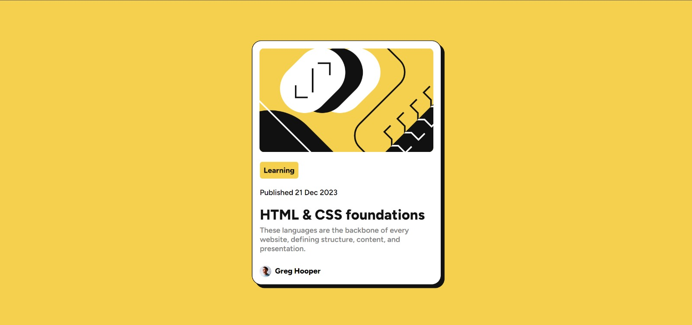
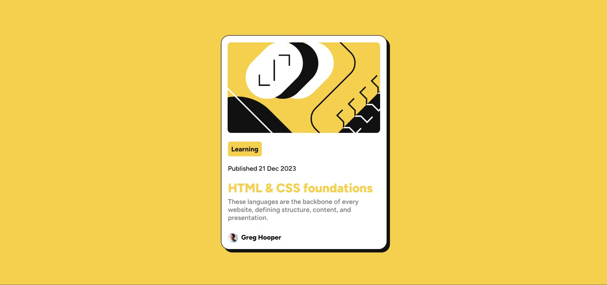

# Frontend Mentor - Blog preview card solution

This is a solution to the [Blog preview card challenge on Frontend Mentor](https://www.frontendmentor.io/challenges/blog-preview-card-ckPaj01IcS). Frontend Mentor challenges help you improve your coding skills by building realistic projects.

## Table of contents

- [Overview](#overview)
  - [The challenge](#the-challenge)
  - [Screenshot](#screenshot)
  - [Links](#links)
- [My process](#my-process)
  - [Built with](#built-with)
  - [What I learned](#what-i-learned)
  - [Continued development](#continued-development)
  - [Useful resources](#useful-resources)
- [Author](#author)

## Overview

### The challenge

Users should be able to:

- See hover and focus states for all interactive elements on the page

### Screenshot

### Links

- Solution URL: [Add solution URL here]([https://your-solution-url.com](https://github.com/thelittleafrican/Blog-Preview-Card-/blob/main/blog-preview-card-main/README.md?plain=1))
- Live Site URL: [Add live site URL here](https://your-live-site-url.com)

## My process

### Built with

- Semantic HTML5 markup
- CSS custom properties
- Flexbox
- CSS Grid

### What I learned

As a newbie to programming, I learned that you learn best by trying. It certainly may not be the best or perfect but at the end of the day you did it. All pro programmers start at this level so I guess I am doing quite ok.

### Continued development

I will definitely look into CSS styling: concepts such as flexbox, grid, margin and padding as I still have a challenge working around them.

### Useful resources

- [W3 Schools](https://www.w3schools.com/css/default.asp) - This helped me with basic guidelines on styling.
- [Code Pen](https://codepen.io/lyon-etyo/pen/OJmyMGd) - This site really helped me with visualizing the challenge and working around how to style with the example provided.

## Author

- Frontend Mentor - [@thelittleafrican](https://www.frontendmentor.io/profile/thelittleafrican)
